# Options for the Fast_i3ock.sh blur settings

Since Fast_i3ock uses ffmpeg to apply the blur any of its scaling filters can be used.
The input and output filter can be independently set to achieve a particular effect, this gives 121 combinations.
The filters currently present in ffmpeg are (in speed order):

- neighbor 0m0.373s
- fast_bilinear 0m0.559s
- experimental 0m0.656s
- bilinear 0m0.672s
- area 0m0.677s
- gauss 0m0.730s
- bicublin 0m0.761s
- bicubic 0m0.802s
- lanczos 0m1.022s
- spline 0m1.044s
- sinc 0m1.569s
- Blurlock's image script 0m5.977s

Tested with A T470s (i7-7600U CPU @ 2C/4T @ 2.80GHz) with a display size of 3840x2160.
Note this time does not include the time for for i3lock to initialise which adds an initial 0.2 seconds.

## Screenshots
### Neighbor
    Creates a blocky image (think 8-bit video game)
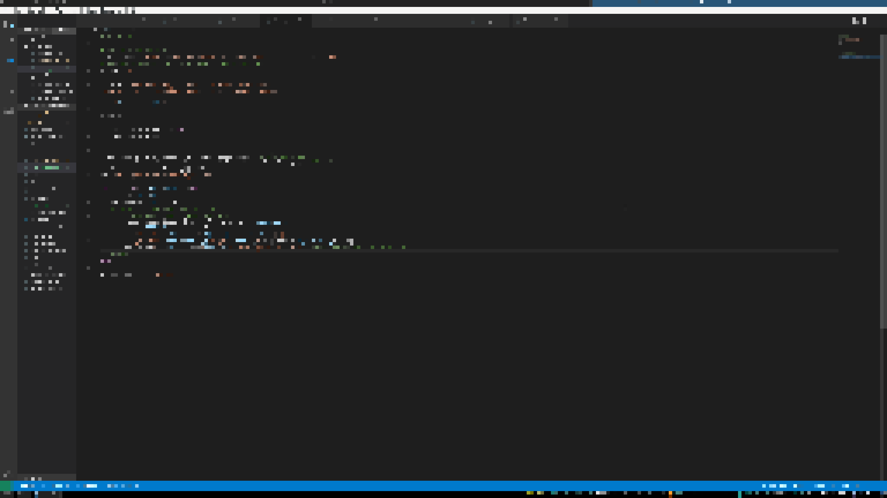

### Fast_bilinear
    Looks like a smoothed version of neighbor
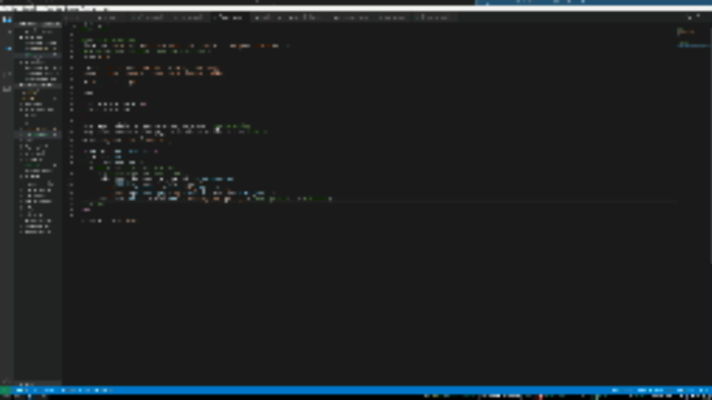

### experimental
    A smoothed blocky image
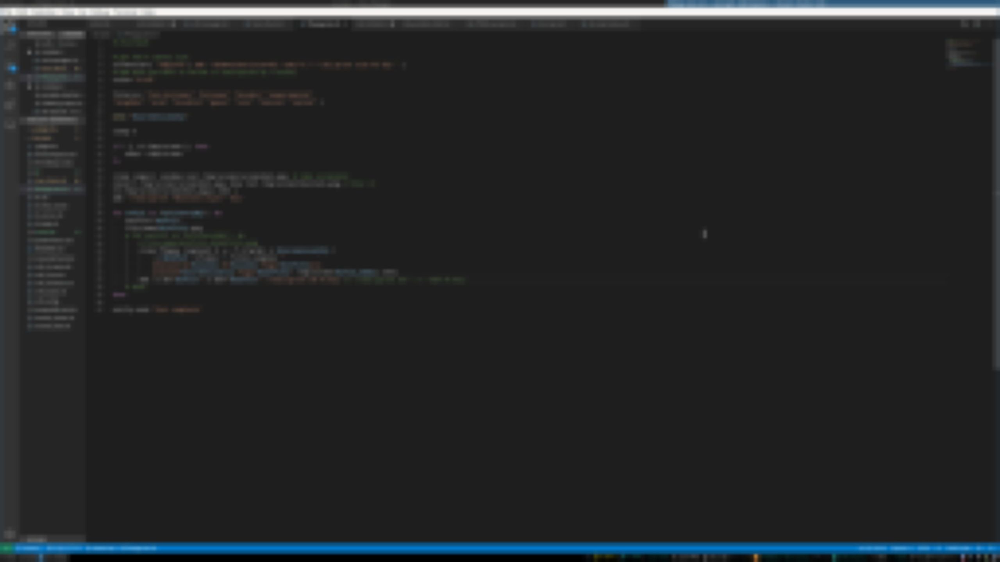

### bilinear
    Very similar to area
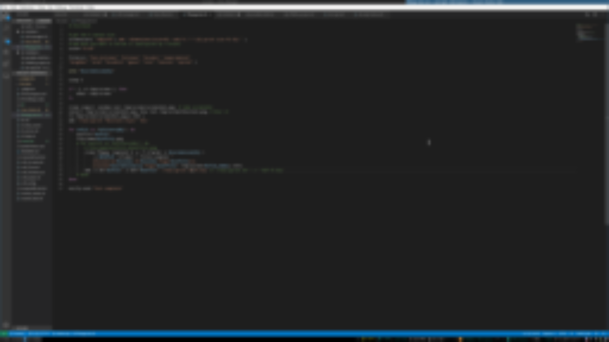

### Area
    Provides a smooth blur
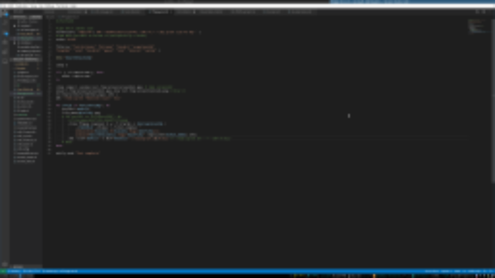

### gauss
    A very sooth and even blur
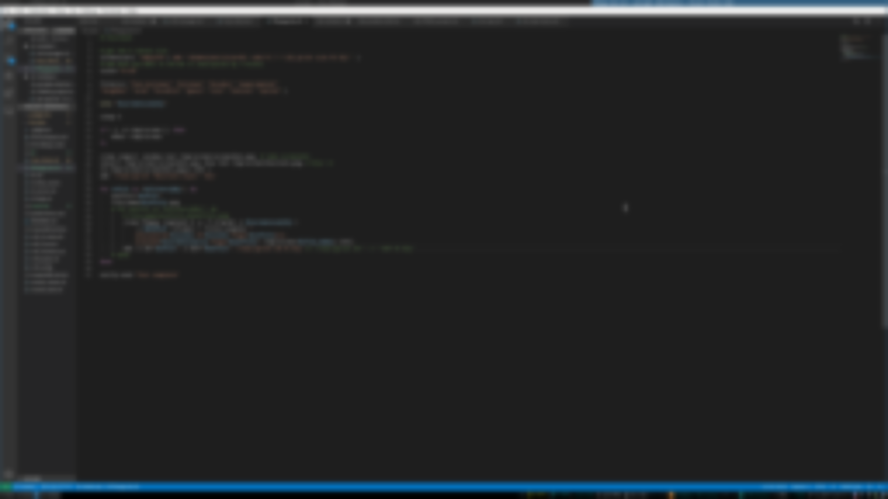

### bicublin
    Provides a smooth blur with better contrast than area
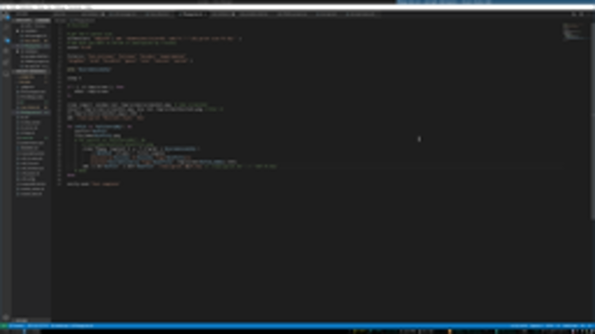

### bicubic
    Very similar to bicublin
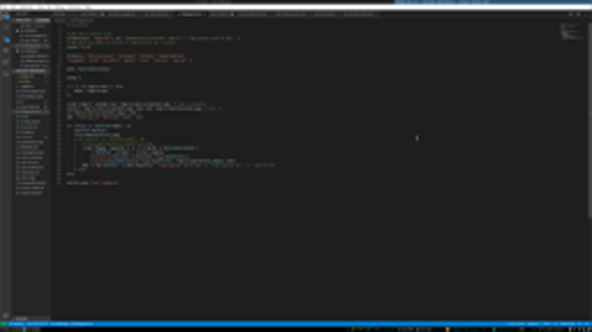

### lanczos
    Similar to bicubic with darker halos around sharp colour changes
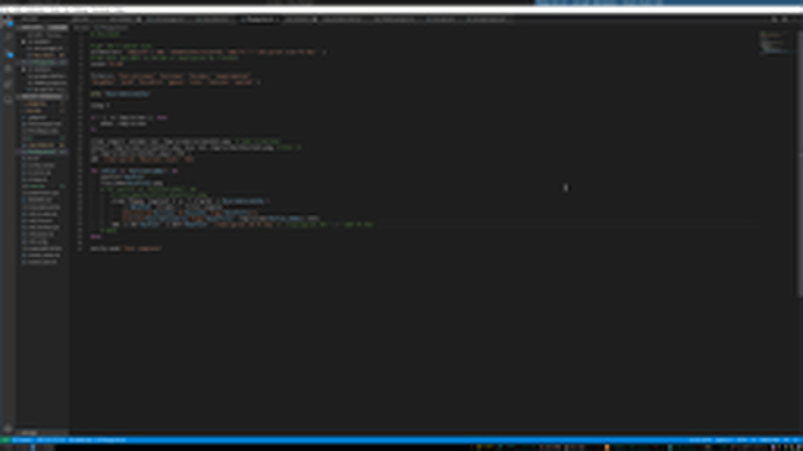

### spline
    Similar to lanczos
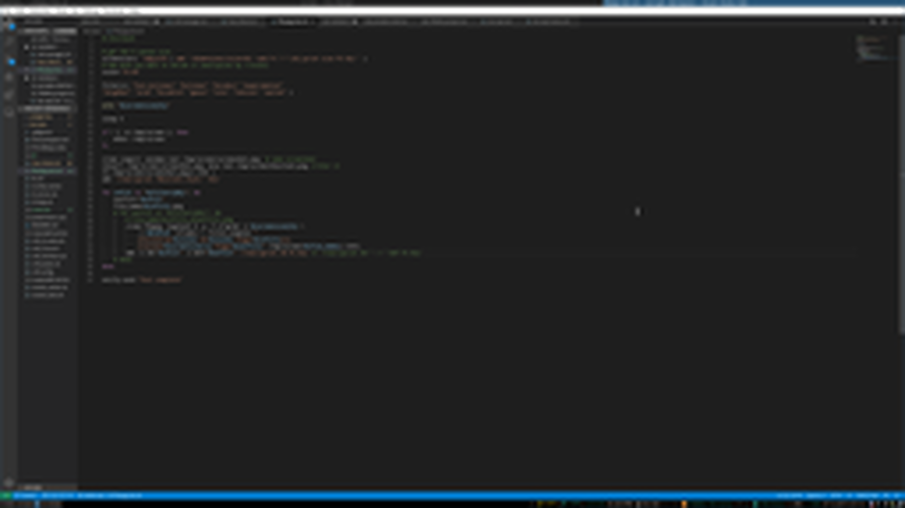

### sinc
    Produces a pixelated image with artefacts at sharp edges
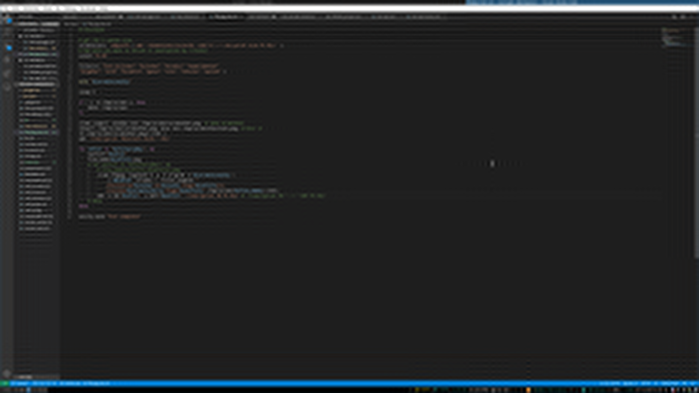

### Blurlock
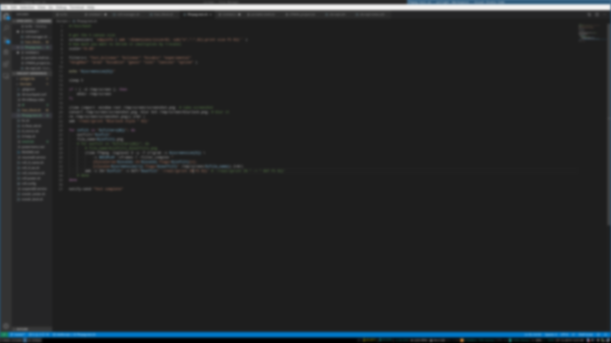
